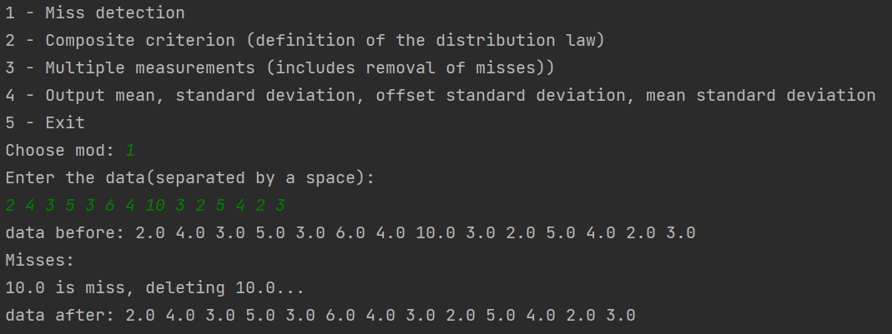

# Metrology
___
## Description
This simple script will help you process measurements, 
and quickly calculate the  static values you need for your task

**For example:**
- find and remove misses
- definition of the distribution law (normal or other)
- calculate mean, standard deviation

This project especially help you in solving educational tasks in metrology

**For example:**
- find misses in this sequence: 3 4 6 5 4 3 7 5 3 2 4 3 6 4 5 3 7 6 5 8 9 4

## Usage
___
- run the script in your python(3.6+) interpreter
- run .exe file
___
**mode 1**

find and remove misses, ****no limit*** on the number of measurements*

**mode 2**

you can check if your measurements fall under the normal distribution law

limit for the number of measurements: n < 50

**mode 3**

combination of **mode 1** and **mode 2 +** you get mean, 
variation of standard deviation; 
that's all complex calculations that you need for process multiple measurements.

**mode 4**

You get mean, standard deviation, offset standard deviation, mean standard deviation

